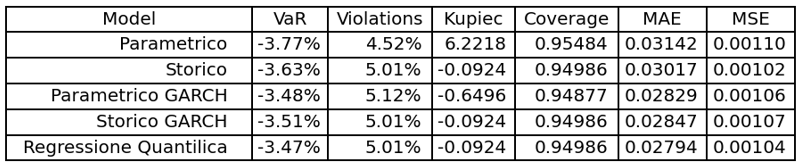
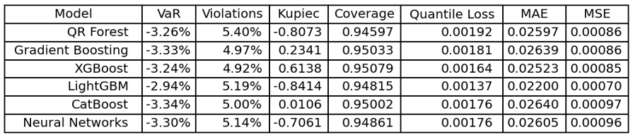

# Brent Oil Value at Risk (VaR) Analysis

This repository presents a comprehensive analysis of **Value at Risk (VaR)** estimation for **Brent Crude Oil**, comparing **classical econometric approaches** with **modern Machine Learning models** based on Quantile Regression.  
The goal of this study is to assess the risk of extreme losses in one of the world’s most volatile and economically significant commodities, and to evaluate how data-driven and learning-based models improve VaR estimation accuracy, calibration, and robustness.

The analysis demonstrates that **machine learning techniques—especially boosting-based models such as CatBoost and LightGBM—outperform traditional VaR approaches** by better capturing nonlinear patterns and time-varying volatility in oil price returns.  
This work provides both a **quantitative comparison** of model performance and a **methodological framework** for integrating AI-driven methods into financial risk management.

---

## Repository Structure

- `data/` : Contains raw (`brent.csv`) and processed datasets (`brentv.csv`) used for the analysis.
- `notebooks/` : Jupyter notebooks with exploratory data analysis, full modeling, and visualization.
- `src/` : Python scripts for complete pipeline execution (data processing, modeling, backtesting).
- `results/` : Backtesting results and visualizations
---

## Analysis Summary

The study focused on [Brent crude oil due to its high volatility and central role in global financial and energy markets](Oil_Market.md).  
The main objective was to analyze the risk of potential losses through VaR estimation and evaluate the performance of different modeling approaches.

### Traditional Models
- **Parametric VaR**: Assumes normally distributed returns, estimating VaR via mean and standard deviation.
- **Historical VaR**: Non-parametric approach based on empirical quantiles of past returns.
- **GARCH-based VaR**: Accounts for time-varying volatility using GARCH(1,1) models, generating both parametric and historical VaR.
- **Quantile Regression VaR**: Estimates VaR directly at a given quantile, adapting to the empirical distribution of returns.

Among these, **Quantile Regression** proved to be the most effective classical model, achieving superior calibration and lower error metrics.

### Machine Learning Models
All ML models were implemented under a Quantile Regression framework for consistency.  
The following were evaluated: **Quantile Regression Forest (QRF), Gradient Boosting, XGBoost, LightGBM, CatBoost, and Neural Networks**.

- **Boosting-based models** (GB, XGB, LGB, CAT) achieved the best overall balance between calibration and accuracy.
- **LightGBM** provided the most accurate VaR predictions, achieving the lowest MAE and MSE.
- **CatBoost** exhibited the most consistent calibration, with violation rates close to the expected 5%.
- **Neural Networks** performed competitively but required extensive tuning to avoid overfitting.
- **Quantile Regression Forest** showed good stability but lower adaptability compared to boosting algorithms.

---

## Backtesting Methodologies

The performance of all VaR models was evaluated using standard backtesting metrics:

1. **Violation Rate / Hit Ratio** – Measures how often actual losses exceed predicted VaR.  
2. **Kupiec Proportion of Failures Test** – Statistical test for model calibration.  
3. **Coverage** – Percentage of observations correctly covered by the VaR level.  
4. **Quantile Loss Function** – Evaluates quantile prediction accuracy.  
5. **MAE / RMSE** – Assess overall prediction error and model precision.

---

## Backtesting Summary

The backtesting phase compared traditional econometric methods with advanced machine learning models for Value at Risk estimation on Brent crude oil returns.  
[Results](./results) show that **Quantile Regression** is the best-performing traditional model, providing excellent calibration and low error metrics. 

Among machine learning techniques, **CatBoost** achieved the most reliable calibration (violations ≈ 5%), while **LightGBM** offered the highest predictive accuracy (lowest MAE and MSE).  

Overall, **boosting-based models** outperformed classical approaches, demonstrating superior adaptability and precision in capturing nonlinear dependencies and volatility dynamics in the oil market.  

*Detailed results and visualizations are available in the [`/results`](./results) folder.*

---

## Key Findings

- **Machine Learning models significantly outperform traditional VaR models** in both robustness and predictive reliability.  
- **Boosting techniques (LightGBM, CatBoost, XGBoost)** are particularly effective for risk modeling.  
- **Quantile Regression** remains a strong benchmark among classical methods.  
- The study highlights the potential for further improvement through the inclusion of additional explanatory variables, the use of deep learning architectures, and the extension of models to portfolio-level risk analysis and stress testing.

---

## Author
Developed by **[Salvatore Spagnuolo](https://github.com/SasySpanish)**  

---
